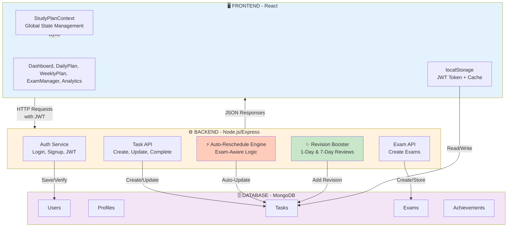
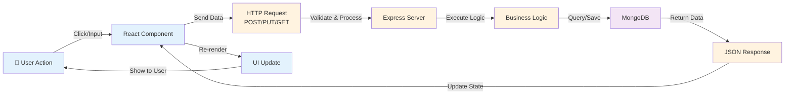
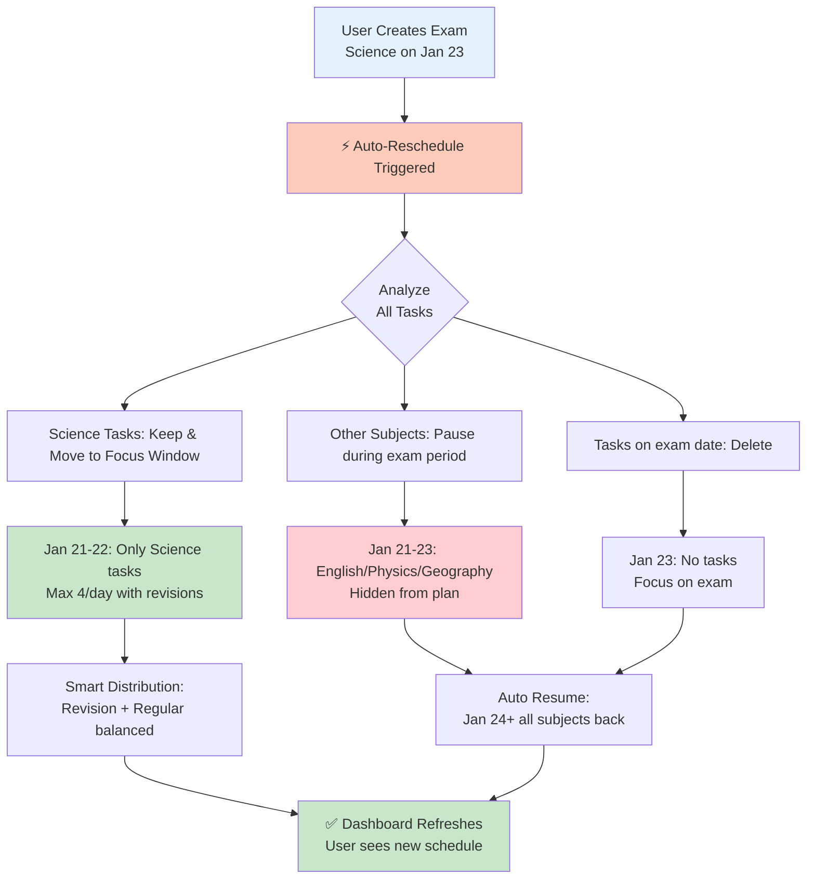

# Study Planner - Smart Exam-Aware Task Scheduler

## 📊 System Architecture



---

## 🎯 Key Features

### 1. **Auto-Reschedule on Exam Creation**
- When user creates exam → System automatically reorganizes tasks
- 2 days before exam: **ONLY exam subject tasks** shown
- Other subjects: **PAUSED** during exam period
- Exam day: **NO tasks** (no studying on exam day)
- Max **4 tasks/day** everywhere

### 2. **Smart Task Distribution**
- Regular days: 3-4 tasks/day (any subject)
- Exam focus window: 2-4 exam subject tasks
- Revision tasks: Auto-generated for completed tasks
- Balanced across available days

### 3. **Revision System**
- When task completed → Auto-create 2 revisions
- 1-Day Review: Next day
- 7-Day Booster: One week later
- Smart scheduling with exam awareness

### 4. **User Journey**
```
Sign Up → Onboarding (Setup Profile & Schedule) → Daily Study → Create Exams → Auto-Reschedule → Dashboard Updates
```

---

## 🔄 Data Flow



---

## 📋 What Gets Stored in MongoDB

| Collection | Purpose |
|-----------|---------|
| **users** | Login credentials, email |
| **profiles** | User preferences (subjects, schedule duration, study time) |
| **tasks** | Daily study tasks with status (Pending, In Progress, Completed) |
| **exams** | Exam dates and subjects |
| **achievements** | Streaks, badges, milestones |

---

## 🎓 Exam-Aware Rescheduling (The Magic ✨)



---

## 🚀 Tech Stack

| Layer | Technology |
|-------|-----------|
| **Frontend** | React 18 + Vite + Tailwind CSS + Context API |
| **Backend** | Node.js + Express.js |
| **Database** | MongoDB (Atlas Cloud) |
| **Auth** | JWT Tokens |
| **Deployment** | Vercel (Frontend) + Heroku/Railway (Backend) |

---

## 📱 User Experience

1. **Sign Up** → Create account with email/password
2. **Onboarding** → Setup subjects, skills, schedule duration (5/15/20/30 days)
3. **Auto Plan Generation** → System generates 3-4 tasks/day for chosen duration
4. **Daily Study** → Complete tasks, earn streaks, unlock achievements
5. **Create Exams** → Add exam dates and subjects
6. **Auto-Reschedule** → System reorganizes plan, focuses on exam subject
7. **Exam Period** → Only exam subject visible for 2 days before exam
8. **Exam Day** → No tasks, student takes exam
9. **Resume** → All subjects resume after exam
10. **Analytics** → Track progress, streaks, achievements

---

## 🎯 Key Algorithms

### Max 4 Tasks Per Day Rule
- Counted every day across the entire plan
- Regular tasks + Revision tasks both count
- Auto-enforced during rescheduling
- Prevents overwhelming user

### 2-Day Focus Window
- Starts: 2 days before exam date
- Ends: Day before exam
- Only exam subject tasks shown
- Other subjects completely hidden (paused)

### Revision Distribution
- After task completion → Create 2 revision tasks
- 1-Day: Complete next day
- 7-Day: Complete 7 days later
- Smart scheduling respects max 4 tasks/day

---

## 📈 Metrics & Analytics

- **Daily Completion Rate**: % of tasks done today
- **Weekly Progress**: Tasks completed this week
- **Subject Performance**: Progress per subject
- **Study Streak**: Consecutive days of studying
- **Achievements**: Badges & milestones unlocked

---

## 🔐 Security

✅ JWT-based authentication  
✅ Password hashing (bcryptjs)  
✅ HTTPS/TLS encryption  
✅ User data isolation (each user sees only their data)  
✅ Input validation on backend  

---

## 📝 Example: Creating an Exam

**Before Exam:**
```
Jan 1-20: Science, English, Physics, Geography (4 tasks/day mix)
```

**User Creates Exam:** Science on Jan 23

**After Auto-Reschedule:**
```
Jan 1-20: Science, English, Physics, Geography (4 tasks/day, unchanged)
Jan 21-22: ONLY Science (2-4 tasks with revisions)
Jan 23: NO tasks (exam day)
Jan 24+: Science, English, Physics, Geography (normal)
```

---

## 🎨 Features Checklist

- ✅ User authentication (Signup/Login)
- ✅ Profile setup with subject selection
- ✅ Automatic study plan generation (3-4 tasks/day)
- ✅ Schedule duration selection (5/15/20/30 days)
- ✅ Daily task tracking
- ✅ Task completion with status updates
- ✅ **Auto-reschedule on exam creation**
- ✅ **Exam-aware task distribution**
- ✅ **Max 4 tasks/day enforcement**
- ✅ **2-day exam focus window**
- ✅ Automatic revision task generation
- ✅ Study streaks & achievements
- ✅ Weekly analytics & charts
- ✅ Real-time plan updates
- ✅ Multiple exam management

---

## 🎬 Getting Started

### Frontend Setup
```bash
npm install
npm run dev
```

### Backend Setup (Future)
```bash
npm install
npm run server
```

### Database
MongoDB Atlas cloud database (connection string in .env)

---

## 📧 Contact & Support

For questions about features or implementation, refer to the documentation above.

---

**Last Updated:** January 6, 2026  
**Status:** ✅ Frontend Complete | ⏳ Backend Ready for Implementation

